<div align="center">


<h1>DevProd Measurement</h1>

<p><strong>The Enterprise Standard for Quantifying Engineering Effectiveness and Developer Experience</strong></p>

[]()
[]()
[]()
[]()

<br/>

> **"You cannot improve what you do not measure."** 
> DevProd Measurement is a flagship repository designed to enable organizations to quantify, improve, and operationalize engineering productivity, delivery flow, and developer experience through data-driven insights.

</div>

---

## 🏛️ Executive Summary

**DevProd Measurement** is a flagship repository designed for Chief Technology Officers (CTOs), Engineering Leaders, and Platform Teams. In the modern enterprise, "measuring productivity" is often misunderstood as individual surveillance. 

This platform provides an industrialized approach to **Engineering Effectiveness**, delivering production-ready **Productivity Analytics**, **Flow Measurement Engines**, **DORA Metric Trackers**, and **Developer Sentiment Analyzers**. It supports **Azure**, **AWS**, **GCP**, and **Kubernetes**, enabling organizations to transition from "Opinion-Based Management" to "Evidence-Based Leadership."

---

## 💡 Why Developer Productivity Matters

Engineering is the primary engine of business value:
- **Velocity vs. Quality**: Understanding the trade-offs between delivery speed and system stability.
- **Flow Efficiency**: Identifying and eliminating the "Wait States" and cognitive load that stall innovation.
- **Developer Experience (DevEx)**: Recognizing that satisfied and empowered developers are the most productive.
- **ROI Realization**: Quantifying the business value returned from engineering and platform investments.

---

## 🚀 Business Outcomes

### 🎯 Strategic Effectiveness Impact
- **Industrialized DORA**: Automating the tracking of Lead Time, Deployment Frequency, CFR, and MTTR.
- **Reduced Cognitive Load**: Identifying friction points in the "Golden Paths" and internal platform services.
- **Optimized Onboarding**: Quantifying the "Time-to-First-PR" to accelerate new hire productivity.
- **Evidence-Based Investment**: Providing data to justify platform engineering and technical debt reduction efforts.

---

## 🏗️ Technical Stack

| Layer | Technology | Rationale |
|---|---|---|
| **Analytics Engine** | Python, Pandas, NumPy | High-performance processing of delivery logs, Git events, and tool telemetry. |
| **Control Plane** | FastAPI | High-performance API for request management and data orchestration. |
| **Frontend** | React 18, Vite | Premium portal for executive dashboards, team scorecards, and trend analysis. |
| **IaC Foundation** | Terraform | Multi-cloud infrastructure consistency and analytics platform automation. |
| **Database** | PostgreSQL | Centralized repository for productivity metadata, trend state, and history. |
| **Observability** | Prometheus / Grafana | Real-time monitoring of platform adoption, data sync health, and system latency. |

---

## 📐 Architecture Storytelling: 70+ Diagrams

### 1. Executive High-Level Architecture
The holistic vision of the enterprise engineering effectiveness journey.

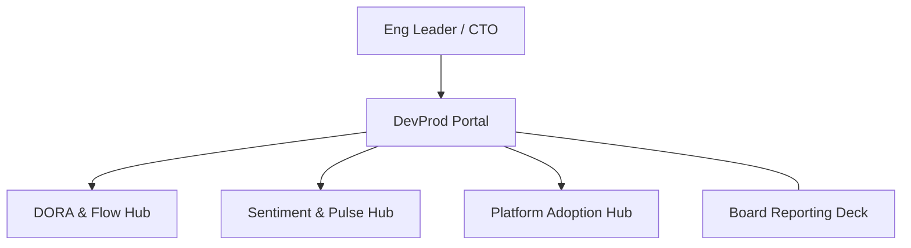

### 2. Detailed Component Topology
The internal service boundaries and management layers of the platform.

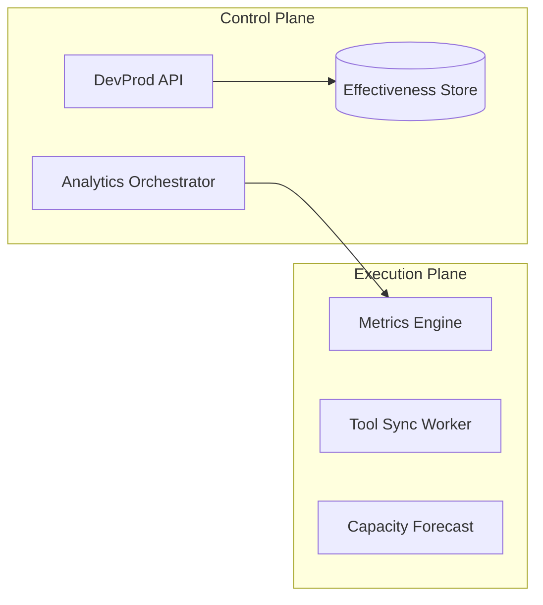

### 3. Frontend to Backend Request Path
Tracing a dashboard request through the industrialized analytics stack.

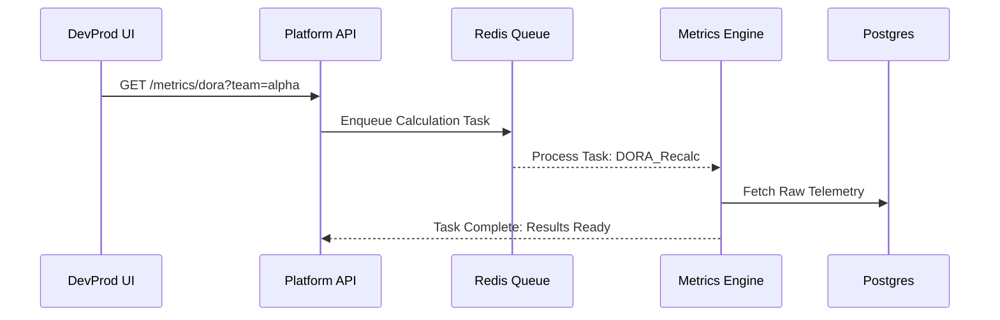

### 4. Metrics Control Plane
The "Brain" of the framework managing global productivity definitions.

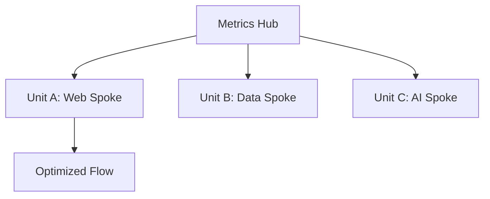

### 5. Multi-Cloud Topology
Synchronizing productivity standards across Azure, AWS, and GCP.

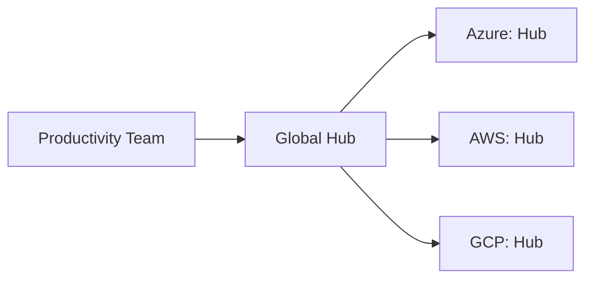

### 6. Regional Deployment Model
Hosting metrics workers close to the target tool environments for performance.

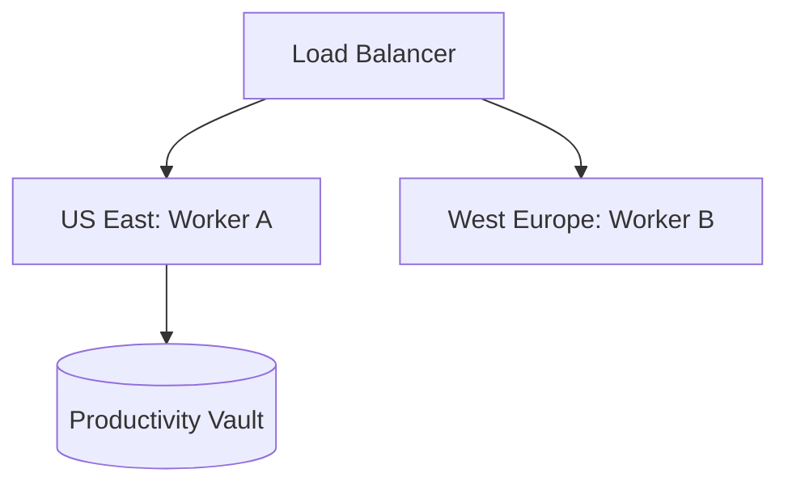

### 7. DR Failover Model
Ensuring analytics continuity during regional cloud outages.

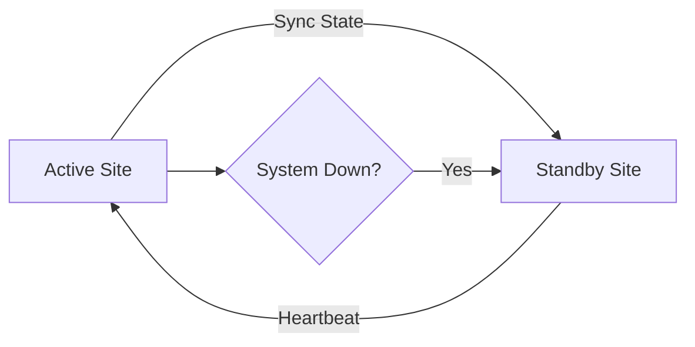

### 8. API Gateway Architecture
Securing and throttling the entry point for effectiveness orchestration.

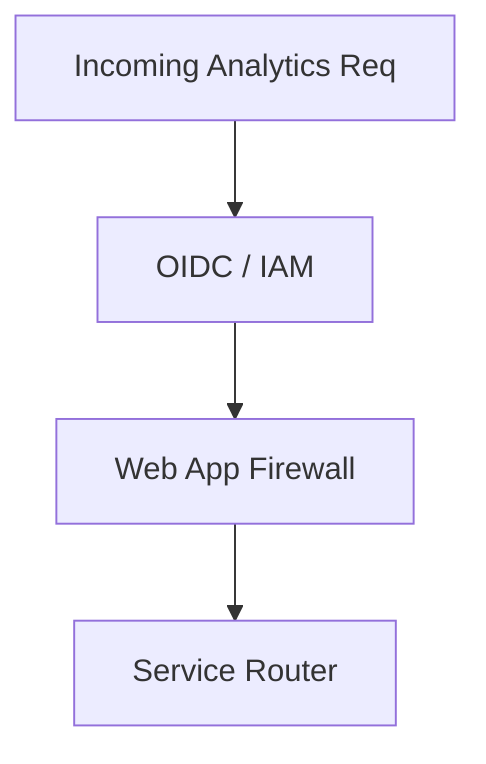

### 9. Queue Worker Architecture
Managing long-running data sync and scoring tasks at scale.

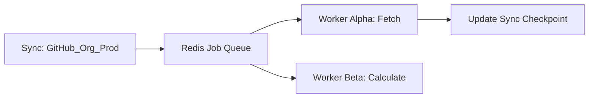

### 10. Dashboard Analytics Flow
How raw tool telemetry becomes executive engineering scorecards.

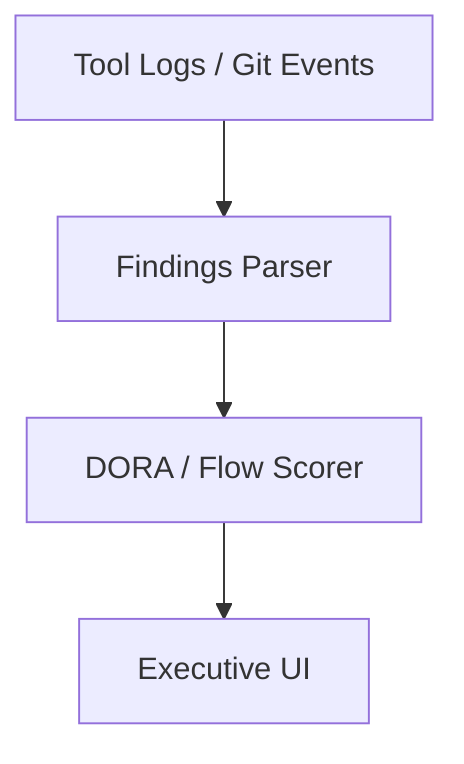

### 11. DORA Metrics Pipeline
The automated flow from tool events to DORA scores.

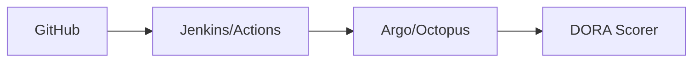

### 12. Lead Time Calculation Model
Measuring the time from "First Commit" to "Production Deploy."

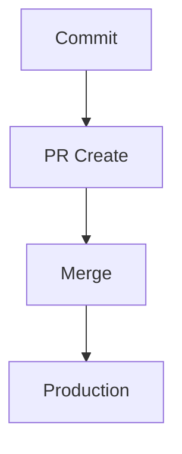

### 13. Deployment Frequency Workflow
Quantifying how often value is delivered to customers.

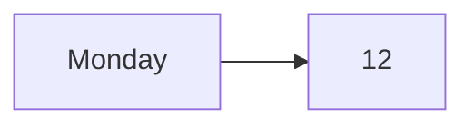

### 14. Change Failure Rate Model
The ratio of failed deployments to total deployments.

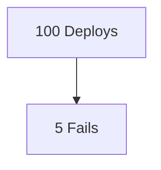

### 15. MTTR Analytics Flow
Mean time to restore service after a failure.

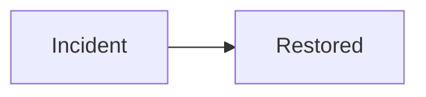

### 16. PR Cycle Time Workflow
The internal lifecycle of a code review.

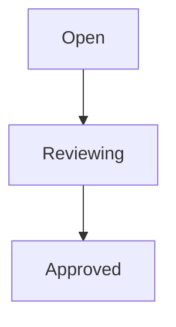

### 17. Review Bottleneck Detection
Identifying reviewers or teams causing review delays.

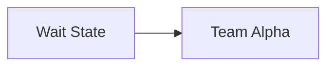

### 18. Work in Progress Flow
Monitoring active tasks per developer to prevent overload.

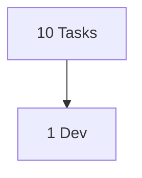

### 19. Flow Efficiency Model
The ratio of active work time to total lead time.

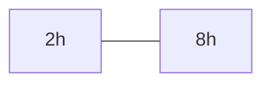

### 20. Context Switching Heatmap
Visualizing disruptions and meetings across the engineering day.

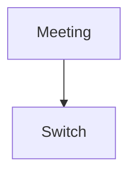

### 21. Golden Path Onboarding Flow
Accelerating the time for new hires to reach "First PR."

```mermaid
graph LR
    Day1[Setup] --> Day5[First PR]
```

### 22. New hire day-1 setup model
The automated provisioning of access and tools.

```mermaid
graph TD
    HR[HR System] --> Provision[Access Tool]
```

### 23. Self-Service Portal Workflow
Enabling developers to spin up resources without tickets.

```mermaid
graph LR
    Req[Need DB] --> Prov[Self-Service]
```

### 24. Template Usage Analytics
Identifying the most (and least) effective golden path templates.

```mermaid
graph TD
    T1[React: 80%] vs T2[Vue: 5%]
```

### 25. Backstage Adoption Model
Tracking the maturity of internal developer portal usage.

```mermaid
graph LR
    Catalog[Catalog] --> Software[Software Templates]
```

### 26. Internal platform dependency map
Visualizing how teams rely on shared platform services.

```mermaid
graph TD
    Team[App Team] --> Platform[K8s Service]
```

### 27. CLI Telemetry Workflow
Understanding how developers interact with internal CLI tools.

```mermaid
graph LR
    Cmd[devex deploy] --> Log[Usage Event]
```

### 28. Docs search experience flow
Measuring the effectiveness of internal documentation.

```mermaid
graph TD
    Search[Search] --> Found[Found]
```

### 29. Support ticket reduction model
Correlating platform improvements with lower ticket volume.

```mermaid
graph LR
    Automation[Automation] --> Tickets[Tickets Down]
```

### 30. Developer journey lifecycle
The long-term career path from Junior to Staff Engineer.

```mermaid
graph TD
    Join[Join] --> Impact[Impact]
```

### 31. CI pipeline analytics
Monitoring build speeds and failure patterns.

```mermaid
graph LR
    Build[Build] --> Duration[4m 20s]
```

### 32. Jenkins pipeline metrics
Tracking legacy pipeline performance.

```mermaid
graph TD
    Job[Build-1] --> Status[Success]
```

### 33. ArgoCD deployment workflow
GitOps-based deployment telemetry.

```mermaid
graph LR
    Git[Git] --> Argo[Syncing]
```

### 34. Kubernetes release model
Measuring the speed of containerized releases.

```mermaid
graph TD
    Image[Image] --> Pod[Pod Ready]
```

### 35. Build cache optimization
Quantifying the impact of build caching on CI speed.

```mermaid
graph LR
    Cache[Cache Hit] --> Fast[Fast]
```

### 36. Failed pipeline triage
Analyzing the time spent fixing broken builds.

```mermaid
graph TD
    Fail[Fail] --> Fix[Fix]
```

### 37. Release approval lifecycle
The impact of manual approvals on lead time.

```mermaid
graph LR
    Req[Prod Req] --> Appr[CAB Approval]
```

### 38. Rollback event analysis
Learning from failed production deployments.

```mermaid
graph TD
    Rollback[Rollback] --> Cause[Bad Config]
```

### 39. Environment wait time model
The delay caused by waiting for staging or QA environments.

```mermaid
graph LR
    Wait[Wait] --> Env[Staging]
```

### 40. Artifact promotion flow
The journey of a binary from Dev to Prod.

```mermaid
graph TD
    Dev[Dev] --> QA[QA] --> Prod[Prod]
```

### 41. Pulse survey workflow
Gathering developer sentiment signals at scale.

```mermaid
graph LR
    Survey[Weekly Survey] --> Insights[Sentiment]
```

### 42. Satisfaction trend model
Tracking developer happiness over time.

```mermaid
graph TD
    Week1[4.2] --> Week4[4.5]
```

### 43. Burnout risk indicators
Identifying teams with high churn or workload stress.

```mermaid
graph LR
    Stress[Load] --> Risk[Burnout]
```

### 44. Team benchmark comparison
Visualizing productivity across different business units.

```mermaid
graph TD
    TeamA[A: High] vs TeamB[B: Low]
```

### 45. Executive KPI review cycle
The rhythm of reporting engineering results to leadership.

```mermaid
graph LR
    Stats[Stats] --> Deck[Executive Deck]
```

### 46. Cost-to-output model
Measuring the efficiency of engineering spend.

```mermaid
graph TD
    Spend[$1M] --> Output[50 Features]
```

### 47. Capacity forecast workflow
Predicting future engineering needs based on throughput.

```mermaid
graph LR
    Velocity[Current] --> Future[Needs]
```

### 48. Quarterly improvement plan
Aligning on productivity goals for the next 90 days.

```mermaid
graph TD
    Plan[Q3 Focus] --> Result[Impact]
```

### 49. ROI of platform engineering
Quantifying the savings generated by self-service automation.

```mermaid
graph LR
    IDP[IDP] --> Savings[$500k/yr]
```

### 50. Adoption maturity roadmap
The journey from manual tracking to industrialized effectiveness.

```mermaid
graph TD
    Level1[Manual] --> Level4[Autonomous]
```

### 51. OIDC / SSO auth flow
Securing the analytics portal with enterprise identity.

```mermaid
graph LR
    User[Dev] --> Okta[Okta / Azure AD]
```

### 52. RBAC model
Defining permissions for managers, leads, and admins.

```mermaid
graph TD
    Role[Manager] --> View[Team View]
```

### 53. Secrets management flow
Securing API tokens for tool integrations.

```mermaid
graph LR
    App[App] --> KV[Key Vault]
```

### 54. Audit logging architecture
Tracking every access and change within the analytics platform.

```mermaid
graph TD
    Event[Login] --> Log[Audit Store]
```

### 55. Metrics pipeline
The internal monitoring of the DevProd platform itself.

```mermaid
graph LR
    Health[CPU/Mem] --> Grafana[Alerts]
```

### 56. Logging architecture
Centralized logging for platform troubleshooting.

```mermaid
graph TD
    Log[Log Line] --> Splunk[Splunk / ELK]
```

### 57. Tracing model
Tracing distributed data sync and calculation requests.

```mermaid
graph LR
    Step1[Fetch] --> Step2[Process]
```

### 58. Incident response workflow
Managing outages of the productivity platform.

```mermaid
graph TD
    Alert[PagerDuty] --> Slack[War Room]
```

### 59. Release governance model
Applying the same standards we measure to the platform itself.

```mermaid
graph LR
    Deploy[Deploy] --> Audit[Audit Trail]
```

### 60. Change management workflow
Modernizing change approvals through automated checks.

```mermaid
graph TD
    Edit[PR] --> Appr[Auto-Approve]
```

### 61. AI productivity insights flow
Using ML to suggest delivery improvements.

```mermaid
graph LR
    Data[CI Logs] --> AI[AI Engine]
```

### 62. Anomaly detection model
Identifying unusual drops in delivery frequency or quality.

```mermaid
graph TD
    Data[Flow] --> Anomaly[Drop Detected]
```

### 63. Forecasting throughput model
Using historical data to predict future delivery dates.

```mermaid
graph LR
    History[Past] --> Forecast[Future]
```

### 64. Team topology analytics
Optimizing team structures for reduced communication overhead.

```mermaid
graph TD
    Map[Comm Map] --> Topology[Optimized]
```

### 65. Cognitive load balancing model
Measuring the mental effort required to manage internal services.

```mermaid
graph LR
    Service[Service] --> Load[High Load]
```

### 66. Skill enablement pathway
Connecting productivity gaps to training needs.

```mermaid
graph TD
    Gap[K8s Gap] --> Training[Enablement]
```

### 67. Portfolio prioritization model
Data-driven alignment of engineering resources.

```mermaid
graph LR
    Value[Value] --> Rank[Rank]
```

### 68. Strategic roadmap flow
Connecting productivity gains to business objectives.

```mermaid
graph TD
    Goal[Speed] --> Impact[Market Share]
```

### 69. Global operating cadence
The rhythm of effectiveness reviews across the enterprise.

```mermaid
graph LR
    Hub[Global] --> Regions[Regional]
```

### 70. Continuous improvement loop
The ultimate feedback cycle for engineering excellence.

```mermaid
graph LR
    Measure[Measure] --> Improve[Improve]
    Improve --> Measure
```

---

## 🔬 Engineering Effectiveness Methodology

### 1. The Productivity Pillars
Our platform is built on four core pillars:
- **Velocity (DORA)**: Speed of delivery and frequency of value creation.
- **Quality (DORA)**: Stability of systems and reliability of releases.
- **Flow Efficiency**: Minimizing wait times and cognitive friction.
- **Developer Experience (DevEx)**: Maximizing satisfaction and reducing mental load.

### 2. Output vs. Outcome
We distinguish between **Output** (PRs merged, lines of code) and **Outcome** (Lead time reduced, customer value delivered). Our analytics prioritize outcome-based signals.

---

## 🚦 Getting Started

### 1. Prerequisites
- **Terraform** (v1.5+).
- **Docker Desktop**.
- **GitHub CLI** configured.

### 2. Local Setup
```bash
# Clone the repository
git clone https://github.com/Devopstrio/devprod-measurement.git
cd devprod-measurement

# Start the Productivity Hub
docker-compose up --build
```
Access the Hub at `http://localhost:3000`.

---

## 🛡️ Governance & Security
- **Privacy-First**: No individual tracking; all metrics are aggregated at the team level.
- **Identity-Driven**: Full OIDC integration for secure access.
- **Tamper-Proof**: All calculation logic is versioned and peer-reviewed.

---
<sub>&copy; 2026 Devopstrio &mdash; Engineering the Future of Global Productivity Measurement.</sub>
